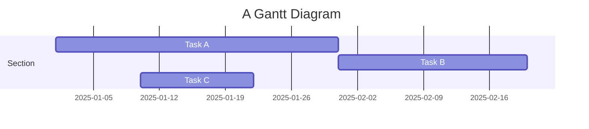
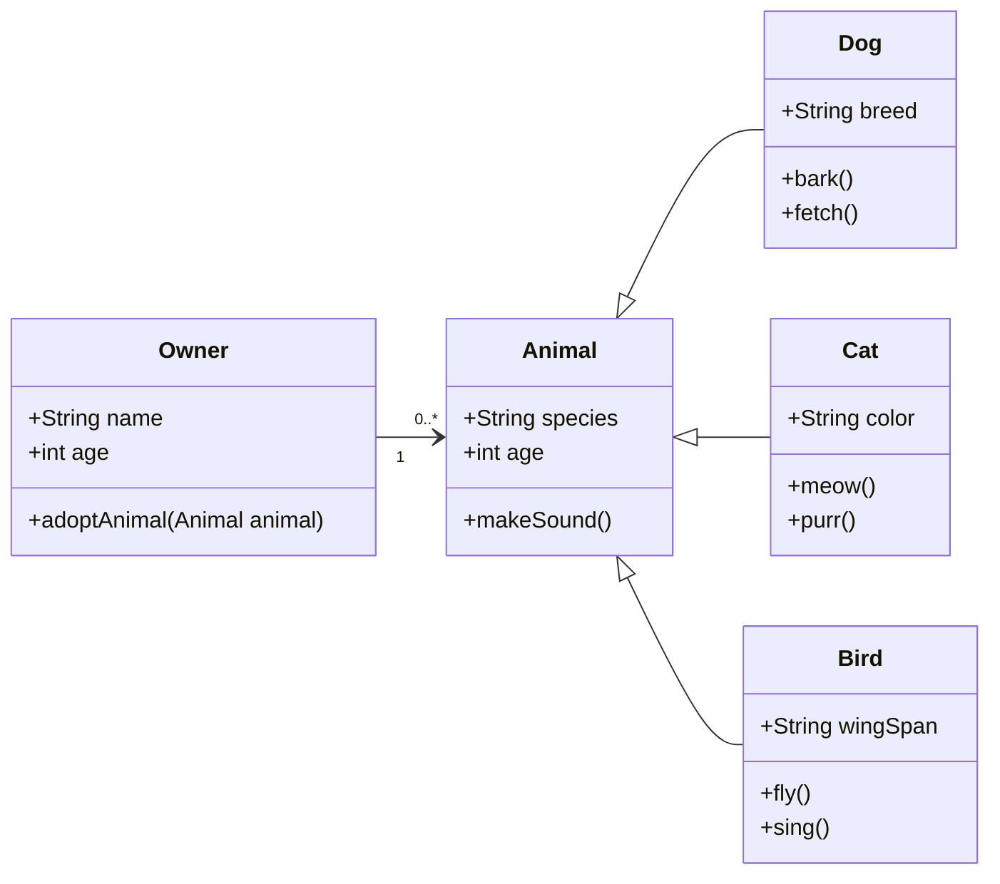

## 公式

本主题支持使用 [MathJax 3](https://www.mathjax.org/) 引擎在行内模式和展示模式下渲染精美的数学公式。
只需将数学表达式用 `$$` 包裹，例如 `$$ E = mc^2 $$`。
如果放在段落内，将产生行内表达式，就像 $$ E = mc^2 $$ 一样。

实际上，您也可以使用单个美元符号 `$` 创建行内公式，例如 `$ E = mc^2 $`，渲染效果为 $ E = mc^2 $。这种方式在基于 TeX 的编译中效果相同，但视觉上比双美元符号 `$$` 略细，与周围文字融合得更自然。

若要使用展示模式，同样用 `$$` 包裹表达式，并将其放置为独立段落。
以下是一个示例：

$$
\left( \sum_{k=1}^n a_k b_k \right)^2 \leq \left( \sum_{k=1}^n a_k^2 \right) \left( \sum_{k=1}^n b_k^2 \right)
$$

值得注意的是，MathJax 3 是对 [MathJax 的重大重写](https://docs.mathjax.org/en/latest/upgrading/whats-new-3.0.html)，大幅提升了加载和渲染速度，目前已[与 KaTeX 相当](http://www.intmath.com/cg5/katex-mathjax-comparison.php)。

---

## 引用

在文章正文中，使用 `<d-cite>` 标签进行引用。
`key` 属性引用参考文献中提供的 id。
`key` 属性可接受多个 id，以逗号分隔。

引用以行内形式呈现，如：<d-cite key="gregor2015draw"></d-cite>（鼠标悬停时显示更多信息的数字编号）。
如果文章包含附录，参考文献列表将自动创建并填充其中。

Distill 选择数字行内引用样式，以提高引用密集型文章的可读性，同时鼠标悬停时可显示更多信息，很大程度上弥补了完整引用的优势。
不过，若在正文中详细讨论某项内容且行文流畅，提及作者姓氏仍是一种良好的写作习惯——作者们都是普通人，社区将他们与其成果联系起来是一件令人欣慰的事。

---

## 脚注

只需将希望显示为脚注的文字用 `<d-footnote>` 标签包裹即可。
脚注编号将自动生成。<d-footnote>这将成为一个可悬停查看的脚注。</d-footnote>

---

## 代码块

语法高亮通过 `<d-code>` 标签实现。
行内代码片段示例：`<d-code language="html">let x = 10;</d-code>`。
对于较大的代码块，添加 `block` 属性：

<d-code block language="javascript">
  var x = 25;
  function(x) {
    return x * x;
  }
</d-code>

**注意：** `<d-code>` 代码块在深色模式下显示效果不佳。您可以改用标准的 Jekyll 语法高亮，即使用 `highlight` Liquid 标签。


var x = 25;
function(x) {
return x \* x;
}


您也可以在三反引号中使用标准 Markdown 代码块并指定语言标签，例如：

```python
def foo(x):
  return x
```

---

## 交互式图表

您可以使用 plotly + iframe 添加交互式图表 :framed_picture:

<div class="l-page">
  <iframe src="{{ '/assets/plotly/demo.html' | relative_url }}" frameborder='0' scrolling='no' height="500px" width="100%" style="border: 1px dashed grey;"></iframe>
</div>

图表需单独生成并保存为 HTML 文件。
若要生成上方所示的图表，可使用以下代码片段：


import pandas as pd
import plotly.express as px
df = pd.read_csv(
'https://raw.githubusercontent.com/plotly/datasets/master/earthquakes-23k.csv'
)
fig = px.density_mapbox(
df,
lat='Latitude',
lon='Longitude',
z='Magnitude',
radius=10,
center=dict(lat=0, lon=180),
zoom=0,
mapbox_style="stamen-terrain",
)
fig.show()
fig.write_html('assets/plotly/demo.html')


---

## Details 折叠框

Details 折叠框是可折叠的内容区块，用于向用户隐藏额外信息。可使用 `details` Liquid 标签添加：


这里是额外的详细内容，其中数学公式 $$ 2x - 1 $$ 和 `代码` 均可正常渲染。


---

## Mermaid

本主题支持使用 [Mermaid](https://mermaid.js.org/) 直接在 Markdown 中创建图表。Mermaid 允许用户渲染流程图、时序图、类图、甘特图等多种图表类型。只需在 mermaid 代码块中嵌入图表语法即可。

创建甘特图的语法如下：

````markdown

````

渲染效果如下：


类似地，您也可以用它创建精美的类图：

````

````

渲染效果如下：


借助 Mermaid，您可以轻松地在博客内容中添加清晰且动态的图表。

---

## Diff2Html

本主题还支持集成 [Diff2Html](https://github.com/rtfpessoa/diff2html)，这是一款可以在 Markdown 中直接渲染代码差异（diff）的工具。Diff2Html 非常适合展示代码变更，让您能够清晰地呈现新增、删除和修改内容。它非常适用于代码审查、文档编写以及需要逐步展示代码变更的教程——甚至可以同时展示多个文件的变更。

````markdown
```diff2html
diff --git a/utils/mathUtils.js b/utils/mathUtils.js
index 3b5f3d1..c7f9b2e 100644
--- a/utils/mathUtils.js
+++ b/utils/mathUtils.js
@@ -1,8 +1,12 @@
-// Basic math utilities
+// Extended math utilities with additional functions

-export function calculateArea(radius) {
-    const PI = 3.14159;
+export function calculateCircleMetrics(radius) {
+    const PI = Math.PI;
     const area = PI * radius ** 2;
+    const circumference = 2 * PI * radius;
+
+    if (!isValidRadius(radius)) throw new Error("Invalid radius");
+
     return { area, circumference };
 }

-export function validateRadius(radius) {
+export function isValidRadius(radius) {
     return typeof radius === 'number' && radius > 0;
 }

diff --git a/main.js b/main.js
index 5f6a9c3..b7d4e8f 100644
--- a/main.js
+++ b/main.js
@@ -2,9 +2,12 @@
 import { calculateCircleMetrics } from './utils/mathUtils';

-function displayCircleMetrics(radius) {
-    const { area } = calculateCircleMetrics(radius);
+function displayCircleMetrics(radius) {
+    const { area, circumference } = calculateCircleMetrics(radius);
     console.log(`Area: ${area}`);
+    console.log(`Circumference: ${circumference}`);
 }

-displayCircleMetrics(5);
+try {
+    displayCircleMetrics(5);
+} catch (error) {
+    console.error("Error:", error.message);
+}
```
````

以下是使用 Diff2Html 渲染后的效果：

```diff2html
diff --git a/utils/mathUtils.js b/utils/mathUtils.js
index 3b5f3d1..c7f9b2e 100644
--- a/utils/mathUtils.js
+++ b/utils/mathUtils.js
@@ -1,8 +1,12 @@
-// Basic math utilities
+// Extended math utilities with additional functions

-export function calculateArea(radius) {
-    const PI = 3.14159;
+export function calculateCircleMetrics(radius) {
+    const PI = Math.PI;
     const area = PI * radius ** 2;
+    const circumference = 2 * PI * radius;
+
+    if (!isValidRadius(radius)) throw new Error("Invalid radius");
+
     return { area, circumference };
 }

-export function validateRadius(radius) {
+export function isValidRadius(radius) {
     return typeof radius === 'number' && radius > 0;
 }

diff --git a/main.js b/main.js
index 5f6a9c3..b7d4e8f 100644
--- a/main.js
+++ b/main.js
@@ -2,9 +2,12 @@
 import { calculateCircleMetrics } from './utils/mathUtils';

-function displayCircleMetrics(radius) {
-    const { area } = calculateCircleMetrics(radius);
+function displayCircleMetrics(radius) {
+    const { area, circumference } = calculateCircleMetrics(radius);
     console.log(`Area: ${area}`);
+    console.log(`Circumference: ${circumference}`);
 }

-displayCircleMetrics(5);
+try {
+    displayCircleMetrics(5);
+} catch (error) {
+    console.error("Error:", error.message);
+}
```

---

## Leaflet

[Leaflet](https://leafletjs.com/) 由乌克兰软件工程师 [Volodymyr Agafonkin](https://agafonkin.com/) 开发，支持在网页中嵌入交互式地图。通过支持 [GeoJSON 数据](https://geojson.org/)，Leaflet 允许您高亮显示特定区域，从而便于详细可视化地理信息。

您可以使用以下代码在 [OpenStreetMap](https://www.openstreetmap.org/) 上加载地图信息：

````markdown
```geojson
{
  "type": "FeatureCollection",
  "features": [
    {
      "type": "Feature",
      "properties": {
        "name": "Crimea",
        "popupContent": "Occupied Crimea"
      },
      "geometry": {
        "type": "Polygon",
        "coordinates": [
          [
            [
              33.9,
              45.3
            ],
            [
              36.5,
              45.3
            ],
            [
              36.5,
              44.4
            ],
            [
              33.9,
              44.4
            ],
            [
              33.9,
              45.3
            ]
          ]
        ]
      }
    },
    {
      "type": "Feature",
      "properties": {
        "name": "Donetsk",
        "popupContent": "Occupied Donetsk"
      },
      "geometry": {
        "type": "Polygon",
        "coordinates": [
          [
            [
              37.5,
              48.5
            ],
            [
              39.5,
              48.5
            ],
            [
              39.5,
              47.5
            ],
            [
              37.5,
              47.5
            ],
            [
              37.5,
              48.5
            ]
          ]
        ]
      }
    },
    {
      "type": "Feature",
      "properties": {
        "name": "Luhansk",
        "popupContent": "Occupied Luhansk"
      },
      "geometry": {
        "type": "Polygon",
        "coordinates": [
          [
            [
              38.5,
              49.5
            ],
            [
              40.5,
              49.5
            ],
            [
              40.5,
              48.5
            ],
            [
              38.5,
              48.5
            ],
            [
              38.5,
              49.5
            ]
          ]
        ]
      }
    },
    {
      "type": "Feature",
      "properties": {
        "name": "Kherson",
        "popupContent": "Occupied Kherson"
      },
      "geometry": {
        "type": "Polygon",
        "coordinates": [
          [
            [
              32.3,
              47.3
            ],
            [
              34.3,
              47.3
            ],
            [
              34.3,
              46.3
            ],
            [
              32.3,
              46.3
            ],
            [
              32.3,
              47.3
            ]
          ]
        ]
      }
    },
    {
      "type": "Feature",
      "properties": {
        "name": "Zaporizhzhia",
        "popupContent": "Occupied Zaporizhzhia"
      },
      "geometry": {
        "type": "Polygon",
        "coordinates": [
          [
            [
              34.3,
              48
            ],
            [
              36.3,
              48
            ],
            [
              36.3,
              47
            ],
            [
              34.3,
              47
            ],
            [
              34.3,
              48
            ]
          ]
        ]
      }
    }
  ]
}
```
````

下方渲染出的地图标注了多年来被俄罗斯非法占领的乌克兰领土，包括克里米亚及东部四个地区：

```geojson
{
  "type": "FeatureCollection",
  "features": [
    {
      "type": "Feature",
      "properties": {
        "name": "Crimea",
        "popupContent": "Occupied Crimea"
      },
      "geometry": {
        "type": "Polygon",
        "coordinates": [
          [
            [
              33.9,
              45.3
            ],
            [
              36.5,
              45.3
            ],
            [
              36.5,
              44.4
            ],
            [
              33.9,
              44.4
            ],
            [
              33.9,
              45.3
            ]
          ]
        ]
      }
    },
    {
      "type": "Feature",
      "properties": {
        "name": "Donetsk",
        "popupContent": "Occupied Donetsk"
      },
      "geometry": {
        "type": "Polygon",
        "coordinates": [
          [
            [
              37.5,
              48.5
            ],
            [
              39.5,
              48.5
            ],
            [
              39.5,
              47.5
            ],
            [
              37.5,
              47.5
            ],
            [
              37.5,
              48.5
            ]
          ]
        ]
      }
    },
    {
      "type": "Feature",
      "properties": {
        "name": "Luhansk",
        "popupContent": "Occupied Luhansk"
      },
      "geometry": {
        "type": "Polygon",
        "coordinates": [
          [
            [
              38.5,
              49.5
            ],
            [
              40.5,
              49.5
            ],
            [
              40.5,
              48.5
            ],
            [
              38.5,
              48.5
            ],
            [
              38.5,
              49.5
            ]
          ]
        ]
      }
    },
    {
      "type": "Feature",
      "properties": {
        "name": "Kherson",
        "popupContent": "Occupied Kherson"
      },
      "geometry": {
        "type": "Polygon",
        "coordinates": [
          [
            [
              32.3,
              47.3
            ],
            [
              34.3,
              47.3
            ],
            [
              34.3,
              46.3
            ],
            [
              32.3,
              46.3
            ],
            [
              32.3,
              47.3
            ]
          ]
        ]
      }
    },
    {
      "type": "Feature",
      "properties": {
        "name": "Zaporizhzhia",
        "popupContent": "Occupied Zaporizhzhia"
      },
      "geometry": {
        "type": "Polygon",
        "coordinates": [
          [
            [
              34.3,
              48
            ],
            [
              36.3,
              48
            ],
            [
              36.3,
              47
            ],
            [
              34.3,
              47
            ],
            [
              34.3,
              48
            ]
          ]
        ]
      }
    }
  ]
}
```

---

## Chartjs、Echarts 和 Vega-Lite

[Chart.js](https://www.chartjs.org/) 是一个功能多样的 JavaScript 库，用于创建响应式交互图表。它支持柱状图、折线图、饼图、雷达图等多种图表类型，是在网页中直接可视化数据的理想工具。

以下是一个 JSON 风格的配置示例，用于在 Chart.js 中创建柱状图：

````
```chartjs
{
  "type": "bar",
  "data": {
    "labels": ["2017", "2018", "2019", "2020", "2021"],
    "datasets": [
      {
        "label": "Population (millions)",
        "data": [12, 15, 13, 14, 16],
        "backgroundColor": "rgba(54, 162, 235, 0.6)",
        "borderColor": "rgba(54, 162, 235, 1)",
        "borderWidth": 1
      }
    ]
  },
  "options": {
    "scales": {
      "y": {
        "beginAtZero": true
      }
    }
  }
}
```
````

渲染出的柱状图展示了 2017 年至 2021 年的人口数据：

```chartjs
{
  "type": "bar",
  "data": {
    "labels": ["2017", "2018", "2019", "2020", "2021"],
    "datasets": [
      {
        "label": "Population (millions)",
        "data": [12, 15, 13, 14, 16],
        "backgroundColor": "rgba(54, 162, 235, 0.6)",
        "borderColor": "rgba(54, 162, 235, 1)",
        "borderWidth": 1
      }
    ]
  },
  "options": {
    "scales": {
      "y": {
        "beginAtZero": true
      }
    }
  }
}
```

---

[ECharts](https://echarts.apache.org/) 是 [Apache](https://www.apache.org/) 旗下一款功能强大的可视化库，支持散点图、热力图、地理地图等多种高级交互式图表类型。

以下 JSON 配置创建了一个视觉效果丰富的折线图，展示两款产品的月度销售数据：

````
```echarts
{
  "title": {
    "text": "Monthly Sales Comparison",
    "left": "center"
  },
  "tooltip": {
    "trigger": "axis",
    "backgroundColor": "rgba(50, 50, 50, 0.7)",
    "borderColor": "#777",
    "borderWidth": 1,
    "textStyle": {
      "color": "#fff"
    }
  },
  "legend": {
    "data": ["Product A", "Product B"],
    "top": "10%"
  },
  "xAxis": {
    "type": "category",
    "data": ["Jan", "Feb", "Mar", "Apr", "May", "Jun", "Jul", "Aug", "Sep", "Oct", "Nov", "Dec"],
    "axisLine": {
      "lineStyle": {
        "color": "#888"
      }
    }
  },
  "yAxis": {
    "type": "value",
    "axisLine": {
      "lineStyle": {
        "color": "#888"
      }
    },
    "splitLine": {
      "lineStyle": {
        "type": "dashed"
      }
    }
  },
  "series": [
    {
      "name": "Product A",
      "type": "line",
      "smooth": true,
      "data": [820, 932, 901, 934, 1290, 1330, 1320, 1400, 1450, 1500, 1600, 1650],
      "itemStyle": {
        "color": "#5470C6"
      },
      "lineStyle": {
        "width": 3
      },
      "areaStyle": {
        "color": {
          "type": "linear",
          "x": 0,
          "y": 0,
          "x2": 0,
          "y2": 1,
          "colorStops": [
            { "offset": 0, "color": "rgba(84, 112, 198, 0.5)" },
            { "offset": 1, "color": "rgba(84, 112, 198, 0)" }
          ]
        }
      },
      "emphasis": {
        "focus": "series"
      }
    },
    {
      "name": "Product B",
      "type": "line",
      "smooth": true,
      "data": [620, 732, 701, 734, 1090, 1130, 1120, 1200, 1250, 1300, 1400, 1450],
      "itemStyle": {
        "color": "#91CC75"
      },
      "lineStyle": {
        "width": 3
      },
      "areaStyle": {
        "color": {
          "type": "linear",
          "x": 0,
          "y": 0,
          "x2": 0,
          "y2": 1,
          "colorStops": [
            { "offset": 0, "color": "rgba(145, 204, 117, 0.5)" },
            { "offset": 1, "color": "rgba(145, 204, 117, 0)" }
          ]
        }
      },
      "emphasis": {
        "focus": "series"
      }
    }
  ]
}
```
````

渲染结果如下，您还可以用鼠标与之交互：

```echarts
{
  "title": {
    "text": "Monthly Sales Comparison",
    "left": "center"
  },
  "tooltip": {
    "trigger": "axis",
    "backgroundColor": "rgba(50, 50, 50, 0.7)",
    "borderColor": "#777",
    "borderWidth": 1,
    "textStyle": {
      "color": "#fff"
    }
  },
  "legend": {
    "data": ["Product A", "Product B"],
    "top": "10%"
  },
  "xAxis": {
    "type": "category",
    "data": ["Jan", "Feb", "Mar", "Apr", "May", "Jun", "Jul", "Aug", "Sep", "Oct", "Nov", "Dec"],
    "axisLine": {
      "lineStyle": {
        "color": "#888"
      }
    }
  },
  "yAxis": {
    "type": "value",
    "axisLine": {
      "lineStyle": {
        "color": "#888"
      }
    },
    "splitLine": {
      "lineStyle": {
        "type": "dashed"
      }
    }
  },
  "series": [
    {
      "name": "Product A",
      "type": "line",
      "smooth": true,
      "data": [820, 932, 901, 934, 1290, 1330, 1320, 1400, 1450, 1500, 1600, 1650],
      "itemStyle": {
        "color": "#5470C6"
      },
      "lineStyle": {
        "width": 3
      },
      "areaStyle": {
        "color": {
          "type": "linear",
          "x": 0,
          "y": 0,
          "x2": 0,
          "y2": 1,
          "colorStops": [
            { "offset": 0, "color": "rgba(84, 112, 198, 0.5)" },
            { "offset": 1, "color": "rgba(84, 112, 198, 0)" }
          ]
        }
      },
      "emphasis": {
        "focus": "series"
      }
    },
    {
      "name": "Product B",
      "type": "line",
      "smooth": true,
      "data": [620, 732, 701, 734, 1090, 1130, 1120, 1200, 1250, 1300, 1400, 1450],
      "itemStyle": {
        "color": "#91CC75"
      },
      "lineStyle": {
        "width": 3
      },
      "areaStyle": {
        "color": {
          "type": "linear",
          "x": 0,
          "y": 0,
          "x2": 0,
          "y2": 1,
          "colorStops": [
            { "offset": 0, "color": "rgba(145, 204, 117, 0.5)" },
            { "offset": 1, "color": "rgba(145, 204, 117, 0)" }
          ]
        }
      },
      "emphasis": {
        "focus": "series"
      }
    }
  ]
}
```

---

[Vega-Lite](https://vega.github.io/vega-lite/) 是一种声明式可视化语法，允许用户创建、分享和定制各种交互式数据可视化图表。以下 JSON 配置生成了一个简洁的柱状图：

````
```vega_lite
{
  "$schema": "https://vega.github.io/schema/vega/v5.json",
  "width": 400,
  "height": 200,
  "padding": 5,

  "data": [
    {
      "name": "table",
      "values": [
        {"category": "A", "value": 28},
        {"category": "B", "value": 55},
        {"category": "C", "value": 43},
        {"category": "D", "value": 91},
        {"category": "E", "value": 81},
        {"category": "F", "value": 53},
        {"category": "G", "value": 19},
        {"category": "H", "value": 87}
      ]
    }
  ],

  "scales": [
    {
      "name": "xscale",
      "type": "band",
      "domain": {"data": "table", "field": "category"},
      "range": "width",
      "padding": 0.1
    },
    {
      "name": "yscale",
      "type": "linear",
      "domain": {"data": "table", "field": "value"},
      "nice": true,
      "range": "height"
    }
  ],

  "axes": [
    {"orient": "bottom", "scale": "xscale"},
    {"orient": "left", "scale": "yscale"}
  ],

  "marks": [
    {
      "type": "rect",
      "from": {"data": "table"},
      "encode": {
        "enter": {
          "x": {"scale": "xscale", "field": "category"},
          "width": {"scale": "xscale", "band": 0.8},
          "y": {"scale": "yscale", "field": "value"},
          "y2": {"scale": "yscale", "value": 0},
          "fill": {"value": "steelblue"}
        },
        "update": {
          "fillOpacity": {"value": 1}
        },
        "hover": {
          "fill": {"value": "orange"}
        }
      }
    }
  ]
}
```
````

渲染结果展示了一个带有悬停效果的简洁柱状图：

```vega_lite
{
  "$schema": "https://vega.github.io/schema/vega/v5.json",
  "width": 400,
  "height": 200,
  "padding": 5,

  "data": [
    {
      "name": "table",
      "values": [
        {"category": "A", "value": 28},
        {"category": "B", "value": 55},
        {"category": "C", "value": 43},
        {"category": "D", "value": 91},
        {"category": "E", "value": 81},
        {"category": "F", "value": 53},
        {"category": "G", "value": 19},
        {"category": "H", "value": 87}
      ]
    }
  ],

  "scales": [
    {
      "name": "xscale",
      "type": "band",
      "domain": {"data": "table", "field": "category"},
      "range": "width",
      "padding": 0.1
    },
    {
      "name": "yscale",
      "type": "linear",
      "domain": {"data": "table", "field": "value"},
      "nice": true,
      "range": "height"
    }
  ],

  "axes": [
    {"orient": "bottom", "scale": "xscale"},
    {"orient": "left", "scale": "yscale"}
  ],

  "marks": [
    {
      "type": "rect",
      "from": {"data": "table"},
      "encode": {
        "enter": {
          "x": {"scale": "xscale", "field": "category"},
          "width": {"scale": "xscale", "band": 0.8},
          "y": {"scale": "yscale", "field": "value"},
          "y2": {"scale": "yscale", "value": 0},
          "fill": {"value": "steelblue"}
        },
        "update": {
          "fillOpacity": {"value": 1}
        },
        "hover": {
          "fill": {"value": "orange"}
        }
      }
    }
  ]
}
```

---

## TikZ

[TikZ](https://tikz.net/) 是一款基于 LaTeX 的强大绘图工具，由 [TikZJax](https://tikzjax.com/) 提供支持。您可以轻松地将论文、海报和笔记中的 TikZ 绘图迁移到此处使用。例如，我们可以使用以下代码来说明欧拉公式 $ e^{i \theta} = \cos \theta + i \sin \theta $：

```markdown
<script type="text/tikz">
\begin{tikzpicture}
    \filldraw[fill=cyan!10, draw=blue, thick] (0,0) circle (2cm);

    \draw[->, thick] (-2.5,0) -- (2.5,0) node[right] {Re};
    \draw[->, thick] (0,-2.5) -- (0,2.5) node[above] {Im};

    \draw[->, thick, color=purple] (0,0) -- (1.5,1.5);
    \node[color=purple] at (1.1, 1.7) {$e^{i\theta}$};

    \draw[thick] (0.7,0) arc (0:45:0.7);
    \node at (0.9, 0.3) {$\theta$};

    \draw[dashed, color=gray] (1.5,1.5) -- (1.5,0) node[below, black] {$\cos \theta$};
    \draw[dashed, color=gray] (1.5,1.5) -- (0,1.5) node[left, black] {$\sin \theta$};
    \node at (2.2, 0) [below] {1};
    \node at (0, 2.2) [left] {$i$};
    \node at (1.5,1.5) [above right, color=blue] {$(\cos \theta \, \sin \theta)$};
\end{tikzpicture}
</script>
```

渲染结果如下，以矢量图形形式呈现：

<script type="text/tikz">
\begin{tikzpicture}
    \filldraw[fill=cyan!10, draw=blue, thick] (0,0) circle (2cm);

    \draw[->, thick] (-2.5,0) -- (2.5,0) node[right] {Re};
    \draw[->, thick] (0,-2.5) -- (0,2.5) node[above] {Im};

    \draw[->, thick, color=purple] (0,0) -- (1.5,1.5);
    \node[color=purple] at (1.1, 1.7) {$e^{i\theta}$};

    \draw[thick] (0.7,0) arc (0:45:0.7);
    \node at (0.9, 0.3) {$\theta$};

    \draw[dashed, color=gray] (1.5,1.5) -- (1.5,0) node[below, black] {$\cos \theta$};
    \draw[dashed, color=gray] (1.5,1.5) -- (0,1.5) node[left, black] {$\sin \theta$};
    \node at (2.2, 0) [below] {1};
    \node at (0, 2.2) [left] {$i$};
    \node at (1.5,1.5) [above right, color=blue] {$(\cos \theta \, \sin \theta)$};
\end{tikzpicture}
</script>

---

## Typograms

[Typograms](https://google.github.io/typograms/) 是一种将文本与图形相结合、以清晰且视觉吸引力的方式传递信息的表达方式。Typograms 尤其适用于说明文字与图形紧密结合的简单图表、示意图和概念可视化。以下示例展示了一个简单的 Typogram：

````
```typograms
             ___________________
            /                  /|
           /__________________/ |
          |                  |  |
          |     Distill      |  |
          |                  |  |
          |                  | /
          |__________________|/
```
````

渲染结果如下：

```typograms
             ___________________
            /                  /|
           /__________________/ |
          |                  |  |
          |     Distill      |  |
          |                  |  |
          |                  | /
          |__________________|/
```

---

## 布局

正文列称为 body。
这是 `d-article` 元素的所有直接子元素默认采用的布局。

<div class="fake-img l-body">
  <p>.l-body</p>
</div>

对于希望显示得稍大一些的图片，可以使用 `.l-page`：

<div class="fake-img l-page">
  <p>.l-page</p>
</div>

以上所有布局都有 outset 变体，可以让内容稍微突出于正文文字之外。
例如：

<div class="fake-img l-body-outset">
  <p>.l-body-outset</p>
</div>

<div class="fake-img l-page-outset">
  <p>.l-page-outset</p>
</div>

有时您会希望使用完整的浏览器宽度。
为此，使用 `.l-screen`。
您也可以通过 inset 变体让元素距浏览器边缘稍微内缩一些。

<div class="fake-img l-screen">
  <p>.l-screen</p>
</div>
<div class="fake-img l-screen-inset">
  <p>.l-screen-inset</p>
</div>

最后一种布局用于边注、旁注和脚注。
除在移动端屏幕尺寸下外，它不会打断 `.l-body` 大小文字的正常排版流。

<div class="fake-img l-gutter">
  <p>.l-gutter</p>
</div>

---

## 旁注

Distill 支持旁注（Sidenotes），类似于脚注，但显示在页面边距中。
旁注有助于提供额外的上下文或参考内容，而不影响正文的阅读流畅性。

创建旁注主要有两种方式：

**使用 `<aside>` 标签：**

以下代码在边距中创建一个具有 **_distill 样式_** 的旁注：

```html
<aside><p>This is a sidenote using aside tag.</p></aside>
```

<aside><p> 这是使用 `&lt;aside&gt;` 标签创建的旁注</p> </aside>

您还可以在旁注中添加图片（点击图片可放大查看）：


```html
<aside>
  
  <p>
    F.J. Cole, "The History of Albrecht Dürer's Rhinoceros in Zoological Literature," Science, Medicine, and History: Essays on the Evolution of
    Scientific Thought and Medical Practice (London, 1953), ed. E. Ashworth Underwood, 337-356. From page 71 of Edward Tufte's Visual Explanations.
  </p>
</aside>
```



<aside>
  
  <p>F.J. Cole, "The History of Albrecht Dürer's Rhinoceros in Zoological Literature," Science, Medicine, and History: Essays on the Evolution of Scientific Thought and Medical Practice (London, 1953), ed. E. Ashworth Underwood, 337-356. From page 71 of Edward Tufte's Visual Explanations.</p>
</aside>

旁注中也可以包含公式和链接：

在物理学中，质能等价描述了系统静止参考系下质量与能量之间的关系。两者仅相差一个乘法常数和测量单位。

<aside>
  <p>这一原理由爱因斯坦的著名方程定义：$E = mc^2$ <a href="https://en.wikipedia.org/wiki/Mass%E2%80%93energy_equivalence" target="_blank">（来源：维基百科）</a></p>
</aside>

**使用 `l-gutter` 类：**

以下代码在边距中创建一个具有 **_al-folio 样式_** 的旁注：

```html
<div class="l-gutter"><p>This is a sidenote using l-gutter class.</p></div>
```

<div class="l-gutter">
  <p> 这是使用 `l-gutter` 类创建的旁注。 </p>
</div>

---

## 其他排版？

强调，即斜体，使用 _星号_ (`*asterisks*`) 或 _下划线_ (`_underscores_`)。

加重强调，即粗体，使用 **星号** 或 **下划线**。

组合强调，使用 **星号和 _下划线_**。

删除线使用两个波浪号。~~划掉这段。~~

1. 第一个有序列表项
2. 另一个列表项
   ⋅⋅\* 无序子列表。
3. 实际数字不重要，只要是数字即可
   ⋅⋅1. 有序子列表
4. 再一个列表项。

⋅⋅⋅您可以在列表项中放置正确缩进的段落。请注意上方的空行，以及前导空格（至少一个，但这里使用三个以对齐原始 Markdown）。

⋅⋅⋅若要在不产生新段落的情况下换行，需要在行尾添加两个空格。⋅⋅
⋅⋅⋅注意这一行是独立的，但与上一行属于同一段落。⋅⋅
⋅⋅⋅（这与典型的 GFM 换行行为不同，GFM 不需要行尾空格。）

- 无序列表可以使用星号

* 或减号

- 或加号

[行内样式链接](https://www.google.com)

[带标题的行内样式链接](https://www.google.com "Google 主页")

[引用样式链接][任意不区分大小写的引用文本]

[可以用数字作为引用样式链接的定义][1]

或者留空，直接使用[链接文本本身]。

URL 和尖括号中的 URL 会自动转换为链接。
http://www.example.com 或 <http://www.example.com>，有时
example.com（但在 Github 上不会，例如）。

以下是一些文字，展示引用链接可以放在后面。

[任意不区分大小写的引用文本]: https://www.mozilla.org
[1]: http://slashdot.org
[链接文本本身]: http://www.reddit.com

以下是我们的 Logo（悬停可查看标题文字）：

行内样式：


引用样式：
![替代文字][logo]

[logo]: https://github.com/adam-p/markdown-here/raw/master/src/common/images/icon48.png "Logo 标题文字 2"

行内 `代码` 使用 `反引号包裹`。

```javascript
var s = "JavaScript syntax highlighting";
alert(s);
```

```python
s = "Python syntax highlighting"
print s
```

```
未指定语言，因此无语法高亮。
但我们可以加入一个 <b>标签</b>。
```

冒号可用于对齐列。

| 表格          |      是      |  很酷  |
| ------------- | :-----------: | ----: |
| 第 3 列       | 右对齐        | $1600 |
| 第 2 列       |   居中        |   $12 |
| 斑马条纹      |   很整洁      |    $1 |

每个表头单元格之间至少需要 3 个破折号分隔。
外侧竖线（|）是可选的，原始 Markdown 无需排列整齐。您还可以使用行内 Markdown。

| Markdown | 更少      | 美观       |
| -------- | --------- | ---------- |
| _仍然_   | `渲染`    | **良好**   |
| 1        | 2         | 3          |

> 引用块在电子邮件中非常有用，用于模拟回复文本。
> 这一行属于同一引用块。

引用中断。

> 这是一段很长的行，在换行时仍能被正确引用。好的，让我们继续写，确保这段文字足够长，能够真正换行。哦，您还可以在引用块中使用 _Markdown_ **格式**。

以下是我们的起始行。

这一行与上一行之间有两个换行符，因此是一个_独立的段落_。

这一行也是独立的段落，但是……
这一行只有一个换行符，因此在_同一段落_中是独立的一行。
