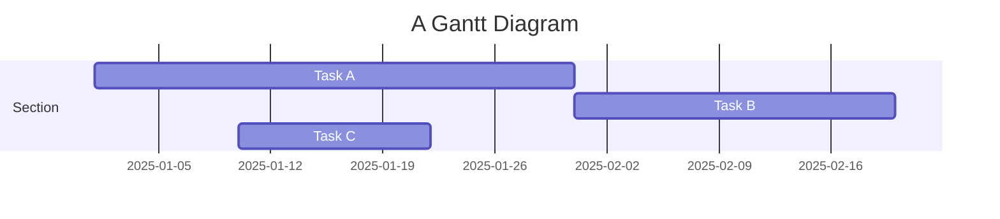
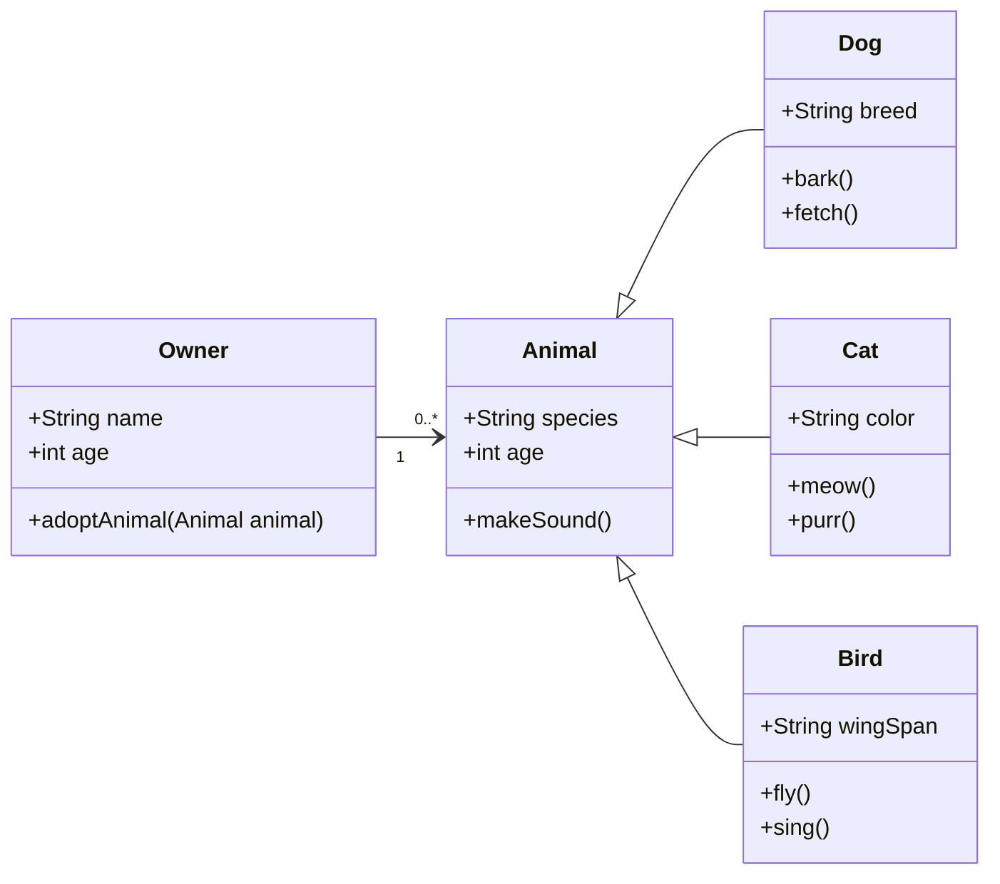

## 方程式

本主题支持使用 [MathJax 3](https://www.mathjax.org/) 引擎在行内和展示模式下渲染精美的数学公式。
只需用 `$$` 将数学表达式括起来即可，例如 `$$ E = mc^2 $$`。
如果放在段落内，会产生行内表达式，就像 $$ E = mc^2 $$ 这样。

实际上，也可以使用单个美元符号 `$` 来创建行内公式，例如 `$ E = mc^2 $`，渲染结果为 $ E = mc^2 $。这种方式在基于 TeX 的编译中效果相同，但视觉上比双美元符号 `$$` 稍微不那么粗体，与周围文字的融合更自然。

要使用展示模式，同样用 `$$` 括起表达式，并将其作为独立段落放置。
示例如下：

$$
\left( \sum_{k=1}^n a_k b_k \right)^2 \leq \left( \sum_{k=1}^n a_k^2 \right) \left( \sum_{k=1}^n b_k^2 \right)
$$

注意，MathJax 3 是 [MathJax 的重大重写版本](https://docs.mathjax.org/en/latest/upgrading/whats-new-3.0.html)，显著提升了加载和渲染速度，现已[与 KaTeX 性能相当](http://www.intmath.com/cg5/katex-mathjax-comparison.php)。

---

## 引用

引用在文章正文中使用 `<d-cite>` 标签。
key 属性是对参考文献中提供的 id 的引用。
key 属性可以接受多个 id，用逗号分隔。

引用以行内方式呈现，如下所示：<d-cite key="gregor2015draw"></d-cite>（悬停时显示更多信息的数字）。
如果有附录，参考文献列表会自动生成并填充其中。

Distill 选择了数字行内引用样式，以提高引用密集型文章的可读性，同时因为悬停显示更多信息的功能使得较长引用的许多优势变得不那么必要。
不过，如果您对某内容进行了详细讨论且文章流畅性允许，我们认为提及作者姓名是好的写作风格——作者们是真实的人，社区将他们与其工作关联起来对他们很有意义。

---

## 脚注

只需将您想在脚注中显示的文本包裹在 `<d-footnote>` 标签中即可。
脚注编号会自动生成。<d-footnote>这将成为一个可悬停的脚注。</d-footnote>

---

## 代码块

在 `<d-code>` 标签内提供语法高亮。
行内代码片段示例：`<d-code language="html">let x = 10;</d-code>`。
对于较大的代码块，添加 `block` 属性：

<d-code block language="javascript">
  var x = 25;
  function(x) {
    return x * x;
  }
</d-code>

**注意：** `<d-code>` 块在深色模式下显示效果不佳。您可以改用带有 `highlight` liquid 标签的标准 Jekyll 语法高亮。


var x = 25;
function(x) {
return x \* x;
}


您也可以使用带语言标签的三个反引号来编写标准 Markdown 代码块，例如：

```python
def foo(x):
  return x
```

---

## 交互式图表

您可以使用 plotly + iframes 添加交互式图表 :framed_picture:

<div class="l-page">
  <iframe src="{{ '/assets/plotly/demo.html' | relative_url }}" frameborder='0' scrolling='no' height="500px" width="100%" style="border: 1px dashed grey;"></iframe>
</div>

图表必须单独生成并保存为 HTML 文件。
要生成上面看到的图表，可以使用以下代码片段：


import pandas as pd
import plotly.express as px
df = pd.read_csv(
'https://raw.githubusercontent.com/plotly/datasets/master/earthquakes-23k.csv'
)
fig = px.density_mapbox(
df,
lat='Latitude',
lon='Longitude',
z='Magnitude',
radius=10,
center=dict(lat=0, lon=180),
zoom=0,
mapbox_style="stamen-terrain",
)
fig.show()
fig.write_html('assets/plotly/demo.html')


---

## 详情框

详情框是可折叠的盒子，用于向用户隐藏附加信息。可以使用 `details` liquid 标签添加：


Additional details, where math $$ 2x - 1 $$ and `code` is rendered correctly.


---

## Mermaid图表

本主题支持使用 [Mermaid](https://mermaid.js.org/) 直接在 markdown 中创建图表。Mermaid 使用户能够渲染流程图、序列图、类图、甘特图等。只需将图表语法嵌入 mermaid 代码块中即可。

要创建甘特图，可以使用以下语法：

````markdown

````

And here’s how it will be rendered:


同样，您也可以用它来创建精美的类图：

````

````

效果如下：


使用 Mermaid，您可以轻松地为博客内容添加清晰动态的图表。

---

## Diff2Html

本主题还支持集成 [Diff2Html](https://github.com/rtfpessoa/diff2html)，这是一个能直接在 markdown 中精美渲染代码差异（diffs）的工具。Diff2Html 非常适合展示代码变更，让您能够清晰地呈现新增、删除和修改内容。它非常适合用于代码审查、文档编写和教程，特别是需要突出显示逐步代码变化的场景——您甚至可以一次展示多个文件的变更。


````markdown
```diff2html
diff --git a/utils/mathUtils.js b/utils/mathUtils.js
index 3b5f3d1..c7f9b2e 100644
--- a/utils/mathUtils.js
+++ b/utils/mathUtils.js
@@ -1,8 +1,12 @@
-// Basic math utilities
+// Extended math utilities with additional functions

-export function calculateArea(radius) {
-    const PI = 3.14159;
+export function calculateCircleMetrics(radius) {
+    const PI = Math.PI;
     const area = PI * radius ** 2;
+    const circumference = 2 * PI * radius;
+
+    if (!isValidRadius(radius)) throw new Error("Invalid radius");
+
     return { area, circumference };
 }

-export function validateRadius(radius) {
+export function isValidRadius(radius) {
     return typeof radius === 'number' && radius > 0;
 }

diff --git a/main.js b/main.js
index 5f6a9c3..b7d4e8f 100644
--- a/main.js
+++ b/main.js
@@ -2,9 +2,12 @@
 import { calculateCircleMetrics } from './utils/mathUtils';

-function displayCircleMetrics(radius) {
-    const { area } = calculateCircleMetrics(radius);
+function displayCircleMetrics(radius) {
+    const { area, circumference } = calculateCircleMetrics(radius);
     console.log(`Area: ${area}`);
+    console.log(`Circumference: ${circumference}`);
 }

-displayCircleMetrics(5);
+try {
+    displayCircleMetrics(5);
+} catch (error) {
+    console.error("Error:", error.message);
+}
```
````

Here’s how it will look when rendered with Diff2Html:

```diff2html
diff --git a/utils/mathUtils.js b/utils/mathUtils.js
index 3b5f3d1..c7f9b2e 100644
--- a/utils/mathUtils.js
+++ b/utils/mathUtils.js
@@ -1,8 +1,12 @@
-// Basic math utilities
+// Extended math utilities with additional functions

-export function calculateArea(radius) {
-    const PI = 3.14159;
+export function calculateCircleMetrics(radius) {
+    const PI = Math.PI;
     const area = PI * radius ** 2;
+    const circumference = 2 * PI * radius;
+
+    if (!isValidRadius(radius)) throw new Error("Invalid radius");
+
     return { area, circumference };
 }

-export function validateRadius(radius) {
+export function isValidRadius(radius) {
     return typeof radius === 'number' && radius > 0;
 }

diff --git a/main.js b/main.js
index 5f6a9c3..b7d4e8f 100644
--- a/main.js
+++ b/main.js
@@ -2,9 +2,12 @@
 import { calculateCircleMetrics } from './utils/mathUtils';

-function displayCircleMetrics(radius) {
-    const { area } = calculateCircleMetrics(radius);
+function displayCircleMetrics(radius) {
+    const { area, circumference } = calculateCircleMetrics(radius);
     console.log(`Area: ${area}`);
+    console.log(`Circumference: ${circumference}`);
 }

-displayCircleMetrics(5);
+try {
+    displayCircleMetrics(5);
+} catch (error) {
+    console.error("Error:", error.message);
+}
```

---

## Leaflet地图

[Leaflet](https://leafletjs.com/) 由乌克兰软件工程师 [Volodymyr Agafonkin](https://agafonkin.com/) 创建，允许在网页中嵌入交互式地图。通过支持 [GeoJSON 数据](https://geojson.org/)，Leaflet 允许您高亮显示特定区域，使地理信息的详细可视化变得简单。

您可以使用以下代码在 [OpenStreetMap](https://www.openstreetmap.org/) 上加载地图信息：

````markdown
```geojson
{
  "type": "FeatureCollection",
  "features": [
    {
      "type": "Feature",
      "properties": {
        "name": "Crimea",
        "popupContent": "Occupied Crimea"
      },
      "geometry": {
        "type": "Polygon",
        "coordinates": [
          [
            [
              33.9,
              45.3
            ],
            [
              36.5,
              45.3
            ],
            [
              36.5,
              44.4
            ],
            [
              33.9,
              44.4
            ],
            [
              33.9,
              45.3
            ]
          ]
        ]
      }
    },
    {
      "type": "Feature",
      "properties": {
        "name": "Donetsk",
        "popupContent": "Occupied Donetsk"
      },
      "geometry": {
        "type": "Polygon",
        "coordinates": [
          [
            [
              37.5,
              48.5
            ],
            [
              39.5,
              48.5
            ],
            [
              39.5,
              47.5
            ],
            [
              37.5,
              47.5
            ],
            [
              37.5,
              48.5
            ]
          ]
        ]
      }
    },
    {
      "type": "Feature",
      "properties": {
        "name": "Luhansk",
        "popupContent": "Occupied Luhansk"
      },
      "geometry": {
        "type": "Polygon",
        "coordinates": [
          [
            [
              38.5,
              49.5
            ],
            [
              40.5,
              49.5
            ],
            [
              40.5,
              48.5
            ],
            [
              38.5,
              48.5
            ],
            [
              38.5,
              49.5
            ]
          ]
        ]
      }
    },
    {
      "type": "Feature",
      "properties": {
        "name": "Kherson",
        "popupContent": "Occupied Kherson"
      },
      "geometry": {
        "type": "Polygon",
        "coordinates": [
          [
            [
              32.3,
              47.3
            ],
            [
              34.3,
              47.3
            ],
            [
              34.3,
              46.3
            ],
            [
              32.3,
              46.3
            ],
            [
              32.3,
              47.3
            ]
          ]
        ]
      }
    },
    {
      "type": "Feature",
      "properties": {
        "name": "Zaporizhzhia",
        "popupContent": "Occupied Zaporizhzhia"
      },
      "geometry": {
        "type": "Polygon",
        "coordinates": [
          [
            [
              34.3,
              48
            ],
            [
              36.3,
              48
            ],
            [
              36.3,
              47
            ],
            [
              34.3,
              47
            ],
            [
              34.3,
              48
            ]
          ]
        ]
      }
    }
  ]
}
```
````

下面渲染的地图展示了多年来被俄罗斯非法占领的乌克兰地区，包括克里米亚和四个东部地区：

```geojson
{
  "type": "FeatureCollection",
  "features": [
    {
      "type": "Feature",
      "properties": {
        "name": "Crimea",
        "popupContent": "Occupied Crimea"
      },
      "geometry": {
        "type": "Polygon",
        "coordinates": [
          [
            [
              33.9,
              45.3
            ],
            [
              36.5,
              45.3
            ],
            [
              36.5,
              44.4
            ],
            [
              33.9,
              44.4
            ],
            [
              33.9,
              45.3
            ]
          ]
        ]
      }
    },
    {
      "type": "Feature",
      "properties": {
        "name": "Donetsk",
        "popupContent": "Occupied Donetsk"
      },
      "geometry": {
        "type": "Polygon",
        "coordinates": [
          [
            [
              37.5,
              48.5
            ],
            [
              39.5,
              48.5
            ],
            [
              39.5,
              47.5
            ],
            [
              37.5,
              47.5
            ],
            [
              37.5,
              48.5
            ]
          ]
        ]
      }
    },
    {
      "type": "Feature",
      "properties": {
        "name": "Luhansk",
        "popupContent": "Occupied Luhansk"
      },
      "geometry": {
        "type": "Polygon",
        "coordinates": [
          [
            [
              38.5,
              49.5
            ],
            [
              40.5,
              49.5
            ],
            [
              40.5,
              48.5
            ],
            [
              38.5,
              48.5
            ],
            [
              38.5,
              49.5
            ]
          ]
        ]
      }
    },
    {
      "type": "Feature",
      "properties": {
        "name": "Kherson",
        "popupContent": "Occupied Kherson"
      },
      "geometry": {
        "type": "Polygon",
        "coordinates": [
          [
            [
              32.3,
              47.3
            ],
            [
              34.3,
              47.3
            ],
            [
              34.3,
              46.3
            ],
            [
              32.3,
              46.3
            ],
            [
              32.3,
              47.3
            ]
          ]
        ]
      }
    },
    {
      "type": "Feature",
      "properties": {
        "name": "Zaporizhzhia",
        "popupContent": "Occupied Zaporizhzhia"
      },
      "geometry": {
        "type": "Polygon",
        "coordinates": [
          [
            [
              34.3,
              48
            ],
            [
              36.3,
              48
            ],
            [
              36.3,
              47
            ],
            [
              34.3,
              47
            ],
            [
              34.3,
              48
            ]
          ]
        ]
      }
    }
  ]
}
```

---

## Chartjs、Echarts与Vega-Lite

[Chart.js](https://www.chartjs.org/) is a versatile JavaScript library for creating responsive and interactive charts. Supporting multiple chart types like bar, line, pie, and radar, it’s an ideal tool for visualizing data directly in webpages.

Here’s an example of a JSON-style configuration that creates a bar chart in Chart.js:

````
```chartjs
{
  "type": "bar",
  "data": {
    "labels": ["2017", "2018", "2019", "2020", "2021"],
    "datasets": [
      {
        "label": "Population (millions)",
        "data": [12, 15, 13, 14, 16],
        "backgroundColor": "rgba(54, 162, 235, 0.6)",
        "borderColor": "rgba(54, 162, 235, 1)",
        "borderWidth": 1
      }
    ]
  },
  "options": {
    "scales": {
      "y": {
        "beginAtZero": true
      }
    }
  }
}
```
````

渲染的柱状图展示了 2017 年至 2021 年的人口数据：

```chartjs
{
  "type": "bar",
  "data": {
    "labels": ["2017", "2018", "2019", "2020", "2021"],
    "datasets": [
      {
        "label": "Population (millions)",
        "data": [12, 15, 13, 14, 16],
        "backgroundColor": "rgba(54, 162, 235, 0.6)",
        "borderColor": "rgba(54, 162, 235, 1)",
        "borderWidth": 1
      }
    ]
  },
  "options": {
    "scales": {
      "y": {
        "beginAtZero": true
      }
    }
  }
}
```

---

[ECharts](https://echarts.apache.org/) 是 [Apache](https://www.apache.org/) 出品的强大可视化库，支持多种交互式图表，包括散点图、热力图和地理地图等更高级的类型。

以下 JSON 配置创建了一个视觉效果增强的折线图，展示两款产品的月度销售数据。

````
```echarts
{
  "title": {
    "text": "Monthly Sales Comparison",
    "left": "center"
  },
  "tooltip": {
    "trigger": "axis",
    "backgroundColor": "rgba(50, 50, 50, 0.7)",
    "borderColor": "#777",
    "borderWidth": 1,
    "textStyle": {
      "color": "#fff"
    }
  },
  "legend": {
    "data": ["Product A", "Product B"],
    "top": "10%"
  },
  "xAxis": {
    "type": "category",
    "data": ["Jan", "Feb", "Mar", "Apr", "May", "Jun", "Jul", "Aug", "Sep", "Oct", "Nov", "Dec"],
    "axisLine": {
      "lineStyle": {
        "color": "#888"
      }
    }
  },
  "yAxis": {
    "type": "value",
    "axisLine": {
      "lineStyle": {
        "color": "#888"
      }
    },
    "splitLine": {
      "lineStyle": {
        "type": "dashed"
      }
    }
  },
  "series": [
    {
      "name": "Product A",
      "type": "line",
      "smooth": true,
      "data": [820, 932, 901, 934, 1290, 1330, 1320, 1400, 1450, 1500, 1600, 1650],
      "itemStyle": {
        "color": "#5470C6"
      },
      "lineStyle": {
        "width": 3
      },
      "areaStyle": {
        "color": {
          "type": "linear",
          "x": 0,
          "y": 0,
          "x2": 0,
          "y2": 1,
          "colorStops": [
            { "offset": 0, "color": "rgba(84, 112, 198, 0.5)" },
            { "offset": 1, "color": "rgba(84, 112, 198, 0)" }
          ]
        }
      },
      "emphasis": {
        "focus": "series"
      }
    },
    {
      "name": "Product B",
      "type": "line",
      "smooth": true,
      "data": [620, 732, 701, 734, 1090, 1130, 1120, 1200, 1250, 1300, 1400, 1450],
      "itemStyle": {
        "color": "#91CC75"
      },
      "lineStyle": {
        "width": 3
      },
      "areaStyle": {
        "color": {
          "type": "linear",
          "x": 0,
          "y": 0,
          "x2": 0,
          "y2": 1,
          "colorStops": [
            { "offset": 0, "color": "rgba(145, 204, 117, 0.5)" },
            { "offset": 1, "color": "rgba(145, 204, 117, 0)" }
          ]
        }
      },
      "emphasis": {
        "focus": "series"
      }
    }
  ]
}
```
````

The rendered output is shown below, and you can also interact with it using your mouse:

```echarts
{
  "title": {
    "text": "Monthly Sales Comparison",
    "left": "center"
  },
  "tooltip": {
    "trigger": "axis",
    "backgroundColor": "rgba(50, 50, 50, 0.7)",
    "borderColor": "#777",
    "borderWidth": 1,
    "textStyle": {
      "color": "#fff"
    }
  },
  "legend": {
    "data": ["Product A", "Product B"],
    "top": "10%"
  },
  "xAxis": {
    "type": "category",
    "data": ["Jan", "Feb", "Mar", "Apr", "May", "Jun", "Jul", "Aug", "Sep", "Oct", "Nov", "Dec"],
    "axisLine": {
      "lineStyle": {
        "color": "#888"
      }
    }
  },
  "yAxis": {
    "type": "value",
    "axisLine": {
      "lineStyle": {
        "color": "#888"
      }
    },
    "splitLine": {
      "lineStyle": {
        "type": "dashed"
      }
    }
  },
  "series": [
    {
      "name": "Product A",
      "type": "line",
      "smooth": true,
      "data": [820, 932, 901, 934, 1290, 1330, 1320, 1400, 1450, 1500, 1600, 1650],
      "itemStyle": {
        "color": "#5470C6"
      },
      "lineStyle": {
        "width": 3
      },
      "areaStyle": {
        "color": {
          "type": "linear",
          "x": 0,
          "y": 0,
          "x2": 0,
          "y2": 1,
          "colorStops": [
            { "offset": 0, "color": "rgba(84, 112, 198, 0.5)" },
            { "offset": 1, "color": "rgba(84, 112, 198, 0)" }
          ]
        }
      },
      "emphasis": {
        "focus": "series"
      }
    },
    {
      "name": "Product B",
      "type": "line",
      "smooth": true,
      "data": [620, 732, 701, 734, 1090, 1130, 1120, 1200, 1250, 1300, 1400, 1450],
      "itemStyle": {
        "color": "#91CC75"
      },
      "lineStyle": {
        "width": 3
      },
      "areaStyle": {
        "color": {
          "type": "linear",
          "x": 0,
          "y": 0,
          "x2": 0,
          "y2": 1,
          "colorStops": [
            { "offset": 0, "color": "rgba(145, 204, 117, 0.5)" },
            { "offset": 1, "color": "rgba(145, 204, 117, 0)" }
          ]
        }
      },
      "emphasis": {
        "focus": "series"
      }
    }
  ]
}
```

---

[Vega-Lite](https://vega.github.io/vega-lite/) is a declarative visualization grammar that allows users to create, share, and customize a wide range of interactive data visualizations. The following JSON configuration generates a straightforward bar chart:

````
```vega_lite
{
  "$schema": "https://vega.github.io/schema/vega/v5.json",
  "width": 400,
  "height": 200,
  "padding": 5,

  "data": [
    {
      "name": "table",
      "values": [
        {"category": "A", "value": 28},
        {"category": "B", "value": 55},
        {"category": "C", "value": 43},
        {"category": "D", "value": 91},
        {"category": "E", "value": 81},
        {"category": "F", "value": 53},
        {"category": "G", "value": 19},
        {"category": "H", "value": 87}
      ]
    }
  ],

  "scales": [
    {
      "name": "xscale",
      "type": "band",
      "domain": {"data": "table", "field": "category"},
      "range": "width",
      "padding": 0.1
    },
    {
      "name": "yscale",
      "type": "linear",
      "domain": {"data": "table", "field": "value"},
      "nice": true,
      "range": "height"
    }
  ],

  "axes": [
    {"orient": "bottom", "scale": "xscale"},
    {"orient": "left", "scale": "yscale"}
  ],

  "marks": [
    {
      "type": "rect",
      "from": {"data": "table"},
      "encode": {
        "enter": {
          "x": {"scale": "xscale", "field": "category"},
          "width": {"scale": "xscale", "band": 0.8},
          "y": {"scale": "yscale", "field": "value"},
          "y2": {"scale": "yscale", "value": 0},
          "fill": {"value": "steelblue"}
        },
        "update": {
          "fillOpacity": {"value": 1}
        },
        "hover": {
          "fill": {"value": "orange"}
        }
      }
    }
  ]
}
```
````

The rendered output shows a clean and simple bar chart with a hover effect：

```vega_lite
{
  "$schema": "https://vega.github.io/schema/vega/v5.json",
  "width": 400,
  "height": 200,
  "padding": 5,

  "data": [
    {
      "name": "table",
      "values": [
        {"category": "A", "value": 28},
        {"category": "B", "value": 55},
        {"category": "C", "value": 43},
        {"category": "D", "value": 91},
        {"category": "E", "value": 81},
        {"category": "F", "value": 53},
        {"category": "G", "value": 19},
        {"category": "H", "value": 87}
      ]
    }
  ],

  "scales": [
    {
      "name": "xscale",
      "type": "band",
      "domain": {"data": "table", "field": "category"},
      "range": "width",
      "padding": 0.1
    },
    {
      "name": "yscale",
      "type": "linear",
      "domain": {"data": "table", "field": "value"},
      "nice": true,
      "range": "height"
    }
  ],

  "axes": [
    {"orient": "bottom", "scale": "xscale"},
    {"orient": "left", "scale": "yscale"}
  ],

  "marks": [
    {
      "type": "rect",
      "from": {"data": "table"},
      "encode": {
        "enter": {
          "x": {"scale": "xscale", "field": "category"},
          "width": {"scale": "xscale", "band": 0.8},
          "y": {"scale": "yscale", "field": "value"},
          "y2": {"scale": "yscale", "value": 0},
          "fill": {"value": "steelblue"}
        },
        "update": {
          "fillOpacity": {"value": 1}
        },
        "hover": {
          "fill": {"value": "orange"}
        }
      }
    }
  ]
}
```

---

## TikZ

[TikZ](https://tikz.net/) 是一个基于 LaTeX 的强大绘图工具，由 [TikZJax](https://tikzjax.com/) 驱动。您可以轻松地从论文、海报和笔记中移植 TikZ 图形。例如，我们可以使用以下代码来说明欧拉公式 $ e^{i \theta} = \cos \theta + i \sin \theta $：’s formula $ e^{i \theta} = \cos \theta + i \sin \theta $:

```markdown
<script type="text/tikz">
\begin{tikzpicture}
    \filldraw[fill=cyan!10, draw=blue, thick] (0,0) circle (2cm);

    \draw[->, thick] (-2.5,0) -- (2.5,0) node[right] {Re};
    \draw[->, thick] (0,-2.5) -- (0,2.5) node[above] {Im};

    \draw[->, thick, color=purple] (0,0) -- (1.5,1.5);
    \node[color=purple] at (1.1, 1.7) {$e^{i\theta}$};

    \draw[thick] (0.7,0) arc (0:45:0.7);
    \node at (0.9, 0.3) {$\theta$};

    \draw[dashed, color=gray] (1.5,1.5) -- (1.5,0) node[below, black] {$\cos \theta$};
    \draw[dashed, color=gray] (1.5,1.5) -- (0,1.5) node[left, black] {$\sin \theta$};
    \node at (2.2, 0) [below] {1};
    \node at (0, 2.2) [left] {$i$};
    \node at (1.5,1.5) [above right, color=blue] {$(\cos \theta \, \sin \theta)$};
\end{tikzpicture}
</script>
```

The rendered output is shown below, displayed as a vector graphic：

<script type="text/tikz">
\begin{tikzpicture}
    \filldraw[fill=cyan!10, draw=blue, thick] (0,0) circle (2cm);

    \draw[->, thick] (-2.5,0) -- (2.5,0) node[right] {Re};
    \draw[->, thick] (0,-2.5) -- (0,2.5) node[above] {Im};

    \draw[->, thick, color=purple] (0,0) -- (1.5,1.5);
    \node[color=purple] at (1.1, 1.7) {$e^{i\theta}$};

    \draw[thick] (0.7,0) arc (0:45:0.7);
    \node at (0.9, 0.3) {$\theta$};

    \draw[dashed, color=gray] (1.5,1.5) -- (1.5,0) node[below, black] {$\cos \theta$};
    \draw[dashed, color=gray] (1.5,1.5) -- (0,1.5) node[left, black] {$\sin \theta$};
    \node at (2.2, 0) [below] {1};
    \node at (0, 2.2) [left] {$i$};
    \node at (1.5,1.5) [above right, color=blue] {$(\cos \theta \, \sin \theta)$};
\end{tikzpicture}
</script>

---

## Typograms

[Typograms](https://google.github.io/typograms/) 是一种将文字和图形结合起来，以清晰且视觉吸引人的方式传达信息的方法。Typograms 特别适合说明文字和图形紧密结合的简单图表、图形和概念可视化。以下示例演示了一个简单的 Typogram：

````
```typograms
             ___________________
            /                  /|
           /__________________/ |
          |                  |  |
          |     Distill      |  |
          |                  |  |
          |                  | /
          |__________________|/
```
````

The rendered output is shown below：

```typograms
             ___________________
            /                  /|
           /__________________/ |
          |                  |  |
          |     Distill      |  |
          |                  |  |
          |                  | /
          |__________________|/
```

---

## 布局

主文本列称为正文。
这是 `d-article` 元素所有直接子元素的默认布局。

<div class="fake-img l-body">
  <p>.l-body</p>
</div>

要显示稍大的图片，请尝试 `.l-page`：

<div class="fake-img l-page">
  <p>.l-page</p>
</div>

所有这些都有外凸变体，如果您想从正文文本中稍微突出一些。
例如：

<div class="fake-img l-body-outset">
  <p>.l-body-outset</p>
</div>

<div class="fake-img l-page-outset">
  <p>.l-page-outset</p>
</div>

有时您可能希望使用完整的浏览器宽度。
为此，请使用 `.l-screen`。
您也可以使用内凹变体，使元素与浏览器边缘稍有间距。

<div class="fake-img l-screen">
  <p>.l-screen</p>
</div>
<div class="fake-img l-screen-inset">
  <p>.l-screen-inset</p>
</div>

最后一种布局用于边注、旁注和脚注。
除在移动屏幕尺寸下外，它不会打断 `.l-body` 大小文本的正常流。

<div class="fake-img l-gutter">
  <p>.l-gutter</p>
</div>

---

## 旁注

Distill 支持旁注，它类似于脚注，但放置在页面的页边距中。
旁注非常适合提供附加上下文或参考资料，而不会打断主文本的流畅性。

创建旁注有两种主要方式：

**使用 `<aside>` 标签：**

以下代码在页边距中创建一个具有 **_distill 样式_** 的旁注：

```html
<aside><p>This is a sidenote using aside tag.</p></aside>
```

<aside><p> This is a sidenote using `&lt;aside&gt;` tag</p> </aside>

我们也可以在旁注中添加图片（点击图片可放大查看更大版本）：


```html
<aside>
  
  <p>
    F.J. Cole, “The History of Albrecht Dürer’s Rhinoceros in Zoological Literature,” Science, Medicine, and History: Essays on the Evolution of
    Scientific Thought and Medical Practice (London, 1953), ed. E. Ashworth Underwood, 337-356. From page 71 of Edward Tufte’s Visual Explanations.
  </p>
</aside>
```



<aside>
  
  <p>F.J. Cole, “The History of Albrecht Dürer’s Rhinoceros in Zoological Literature,” Science, Medicine, and History: Essays on the Evolution of Scientific Thought and Medical Practice (London, 1953), ed. E. Ashworth Underwood, 337-356. From page 71 of Edward Tufte’s Visual Explanations.</p>
</aside>

旁注也可以包含方程式和链接：

在物理学中，质能等价是系统静止参考系中质量和能量之间的关系。两者仅在乘法常数和测量单位上有所不同。

<aside>
  <p>This principle is defined by Einstein's famous equation: $E = mc^2$ <a href="https://en.wikipedia.org/wiki/Mass%E2%80%93energy_equivalence" target="_blank">(Source: Wikipedia)</a></p>
</aside>

**使用 `l-gutter` 类：**

以下代码在页边距中创建一个具有 **_al-folio 样式_** 的旁注：

```html
<div class="l-gutter"><p>This is a sidenote using l-gutter class.</p></div>
```

<div class="l-gutter">
  <p> This is a sidenote using `l-gutter` class. </p>
</div>

---

## 其他排版功能？

强调（斜体），使用 _asterisks_ (`*asterisks*`) or _underscores_ (`_underscores_`).

强调（粗体），使用 **asterisks** 或 **underscores**。

组合强调，使用 **asterisks and _underscores_**。

删除线使用两个波浪号。~~删除这个。~~

1. First ordered list item
2. Another item
   ⋅⋅\* Unordered sub-list.
3. Actual numbers don't matter, just that it's a number
   ⋅⋅1. Ordered sub-list
4. And another item.

⋅⋅⋅You can have properly indented paragraphs within list items. Notice the blank line above, and the leading spaces (at least one, but we'll use three here to also align the raw Markdown).

⋅⋅⋅To have a line break without a paragraph, you will need to use two trailing spaces.⋅⋅
⋅⋅⋅Note that this line is separate, but within the same paragraph.⋅⋅
⋅⋅⋅(This is contrary to the typical GFM line break behaviour, where trailing spaces are not required.)

- Unordered list can use asterisks

* Or minuses

- Or pluses

[I'm an inline-style link](https://www.google.com)

[I'm an inline-style link with title](https://www.google.com "Google's Homepage")

[I'm a reference-style link][Arbitrary case-insensitive reference text]

[You can use numbers for reference-style link definitions][1]

Or leave it empty and use the [link text itself].

URLs and URLs in angle brackets will automatically get turned into links.
http://www.example.com or <http://www.example.com> and sometimes
example.com (but not on Github, for example).

Some text to show that the reference links can follow later.

[arbitrary case-insensitive reference text]: https://www.mozilla.org
[1]: http://slashdot.org
[link text itself]: http://www.reddit.com

Here's our logo (hover to see the title text):

Inline-style:


Reference-style:
![alt text][logo]

[logo]: https://github.com/adam-p/markdown-here/raw/master/src/common/images/icon48.png "Logo Title Text 2"

Inline `code` has `back-ticks around` it.

```javascript
var s = "JavaScript syntax highlighting";
alert(s);
```

```python
s = "Python syntax highlighting"
print s
```

```
No language indicated, so no syntax highlighting.
But let's throw in a <b>tag</b>.
```

Colons can be used to align columns.

| Tables        |      Are      |  Cool |
| ------------- | :-----------: | ----: |
| col 3 is      | right-aligned | $1600 |
| col 2 is      |   centered    |   $12 |
| zebra stripes |   are neat    |    $1 |

There must be at least 3 dashes separating each header cell.
The outer pipes (|) are optional, and you don't need to make the
raw Markdown line up prettily. You can also use inline Markdown.

| Markdown | Less      | Pretty     |
| -------- | --------- | ---------- |
| _Still_  | `renders` | **nicely** |
| 1        | 2         | 3          |

> Blockquotes are very handy in email to emulate reply text.
> This line is part of the same quote.

Quote break.

> This is a very long line that will still be quoted properly when it wraps. Oh boy let's keep writing to make sure this is long enough to actually wrap for everyone. Oh, you can _put_ **Markdown** into a blockquote.

Here's a line for us to start with.

This line is separated from the one above by two newlines, so it will be a _separate paragraph_.

This line is also a separate paragraph, but...
This line is only separated by a single newline, so it's a separate line in the _same paragraph_.
