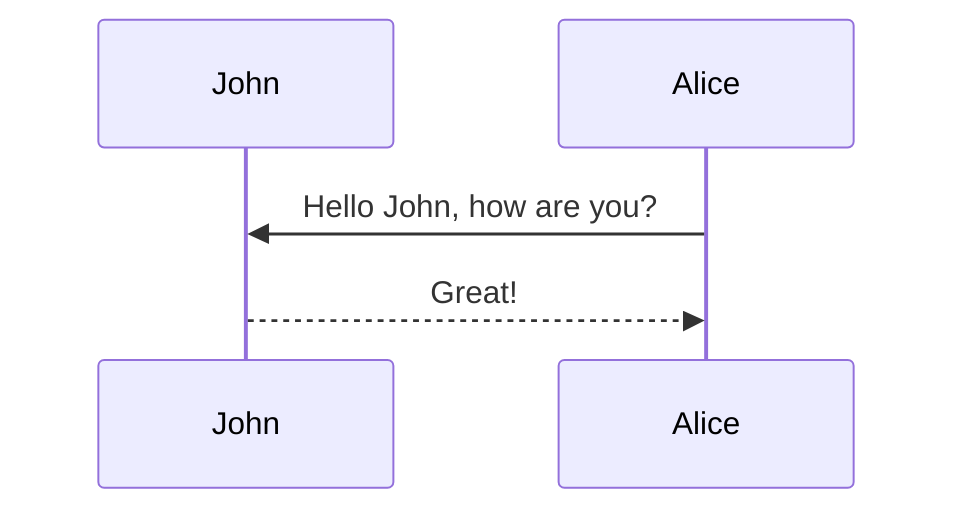
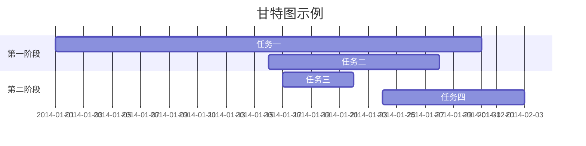

本主题支持使用 [mermaid](https://mermaid-js.github.io/mermaid/){:target="\_blank"} 通过文字描述生成各种图表。此前，这是通过 [jekyll-diagrams](https://github.com/zhustec/jekyll-diagrams){:target="\_blank"} 插件实现的。更多信息请参阅[相关 issue](https://github.com/alshedivat/al-folio/issues/1609#issuecomment-1656995674)。

要启用 mermaid，需要在文章的前置元数据中添加以下内容：

```yml
mermaid:
  enabled: true
  zoomable: true
```

以下是不同图表类型的示例。

**注意：** 目前主题不支持在 mermaid 图表中使用深色模式，因此所有图表在深色模式下都将以白色背景显示。




