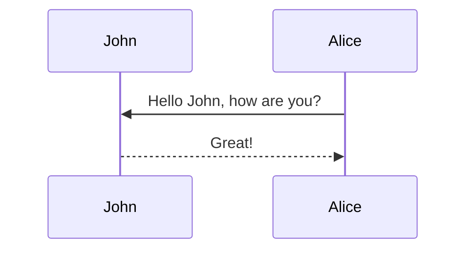

本主题支持使用 [mermaid](https://mermaid-js.github.io/mermaid/){:target="\_blank"} 从文本描述生成各种图表。以前，这是使用 [jekyll-diagrams](https://github.com/zhustec/jekyll-diagrams){:target="\_blank"} 插件完成的。有关此事的更多信息，请参阅[相关问题](https://github.com/alshedivat/al-folio/issues/1609#issuecomment-1656995674)。

要启用 mermaid，您必须在文章前置元数据中添加以下内容：

```yml
mermaid:
  enabled: true
  zoomable: true
```

要禁用缩放功能，请将 `mermaid: zoomable` 设置为 `false`。

## Mermaid

下面的图表是由以下代码生成的：

````markdown

````


